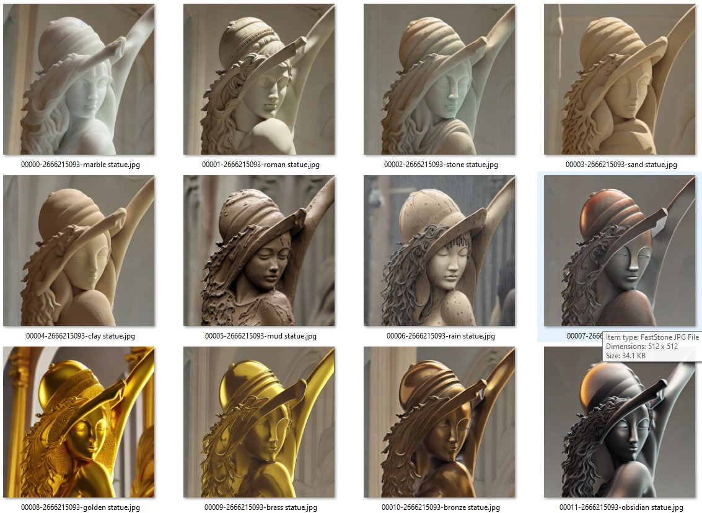
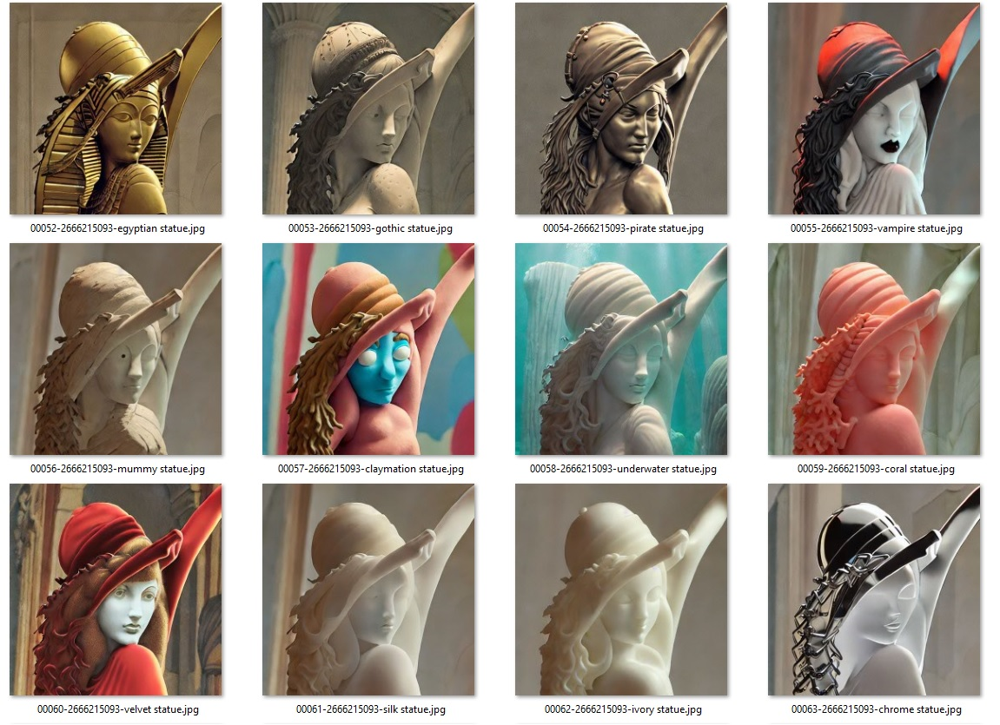

# Prompt-test-for-ControlNet

### Depth map for [Lena](https://upload.wikimedia.org/wikipedia/en/7/7d/Lenna_%28test_image%29.png) 

(preprocessor: depth, Midas Resolution:512)

### Parameters:
    Steps: 20, Sampler: Heun, CFG scale: 7, Seed: 2666215093, Size: 512x512, Model hash: 93a10d6661, Model: ProtoGen_X5.3-pruned-fp16, ControlNet Enabled: True, ControlNet Module: depth, ControlNet Model: control_depth-fp16 [400750f6], ControlNet Weight: 1, ControlNet Guidance Strength: 1

###Preview:

### Bling test:

prompt: underwater, sunbeams, light rays, reflections, sparkle, shimmer, bubbles, seashells, pearls, glitter, bling
Negative prompt: cartoon
Steps: 20, Sampler: Heun, CFG scale: 7, Seed: 2792489378, Size: 512x512, Model hash: 93a10d6661, Model: ProtoGen_X5.3-pruned-fp16, ControlNet Enabled: True, ControlNet Module: depth_leres, ControlNet Model: control_depth-fp16 [400750f6], ControlNet Weight: 1, ControlNet Guidance Strength: 1

